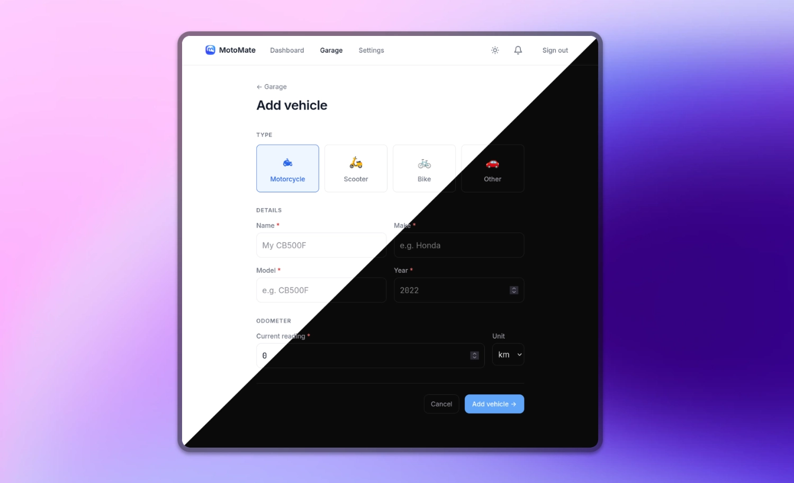

# MotoMate
<!-- ALL-CONTRIBUTORS-BADGE:START - Do not remove or modify this section -->
[](#contributors-)
<!-- ALL-CONTRIBUTORS-BADGE:END -->

[](LICENSE)
[](#)
[](#)
[](https://coff.ee/hawkinslabdev)

Take control of your **vehicle maintenance** with MotoMate, a self-hosted (maintenance) tracking web application. Access your digital maintenance journal from any mobile device to log tasks right from the garage. Because it is self-hosted, your data and service history never leave your own hardware.

View our [**demo-instance here**](https://motomate.mijnmotorparkeren.nl) (hosted by MijnMotorParkeren.nl). Want to try it yourself? Then set-up your own instance using the instructions below.

> [!WARNING]
> **We need your help!** MotoMate is still under _active_ development and you may encounter bugs. Please help improve the project by reporting issues, suggesting missing features, or, preferably, submitting a pull request.



We want to make it incredibly simple for riders and vehicle enthusiasts to host their own maintenance journals. Unlike more complex systems such as [LubeLogger](https://lubelogger.com/?ref=github.com/hawkinslabdev/motomate), MotoMate is designed to strip your tracking down to the absolute essentials. 

## Getting Started

You can run MotoMate locally using Docker Compose:

```yaml
services:
  motomate:
    image: ghcr.io/hawkinslabdev/motomate:latest
    ports:
      - "3000:3000"
    volumes:
      - ./data:/app/data
      - ./uploads:/app/uploads
    environment:
      - TZ=Europe/Amsterdam
      - PUBLIC_APP_URL=http://localhost:3000
      - PUBLIC_APP_ORIGINS=http://localhost
      - AUTH_COOKIE_SECURE=false
      - AUTH_SECRET=change-me-in-production-min-32-chars
      - AUTH_ALLOW_REGISTRATION=true
      - STORAGE_ADAPTER=local
      - BODY_SIZE_LIMIT=20971520
    restart: unless-stopped
```

After downloading the image and starting the container, the application will be ready in a few seconds once database migrations complete.

## Donate

[](https://coff.ee/hawkinslabdev)
[](https://github.com/sponsors/hawkinslabdev)

Want to support MotoMate? Drop a star on GitHub, or consider supporting development via GitHub Sponsors or Buy Me a Coffee.

## License

This project is licensed under the **AGPL 3.0** license. See [LICENSE](LICENSE) for details.

## Contributors

Made possible thanks to the following people:
<!-- ALL-CONTRIBUTORS-LIST:START - Do not remove or modify this section -->
<!-- prettier-ignore-start -->
<!-- markdownlint-disable -->
<table>
  <tbody>
    <tr>
      <td align="center" valign="top" width="14.28%"><a href="https://github.com/hawkinslabdev"><br /><sub><b>[dan]</b></sub></a><br /><a href="https://github.com/hawkinslabdev/motomate/commits?author=hawkinslabdev" title="Code">💻</a></td>
      <td align="center" valign="top" width="14.28%"><a href="https://github.com/gg64nou"><br /><sub><b>Ovidiu</b></sub></a><br /><a href="#translation-gg64nou" title="Translation">🌍</a></td>
    </tr>
  </tbody>
</table>

<!-- markdownlint-restore -->
<!-- prettier-ignore-end -->

<!-- ALL-CONTRIBUTORS-LIST:END -->

<!-- ALL-CONTRIBUTORS-LIST:START - Do not remove or modify this section -->
<!-- prettier-ignore-start -->
<!-- markdownlint-disable -->

<!-- markdownlint-restore -->
<!-- prettier-ignore-end -->

<!-- ALL-CONTRIBUTORS-LIST:END -->

Contributions including ideas, bug reports, and pull requests are welcome. Please open an issue to discuss any proposed changes or identified issues.
